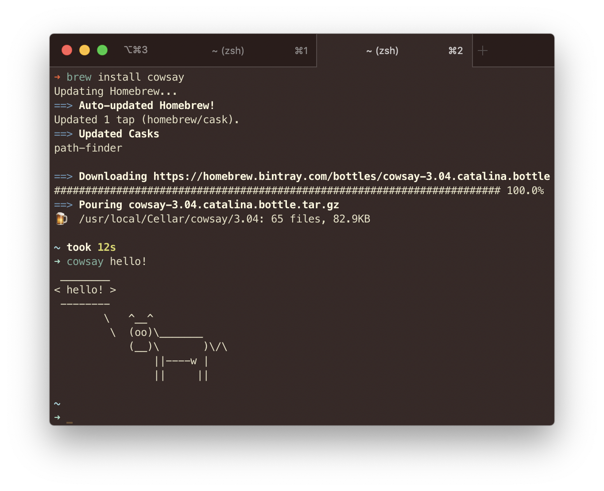
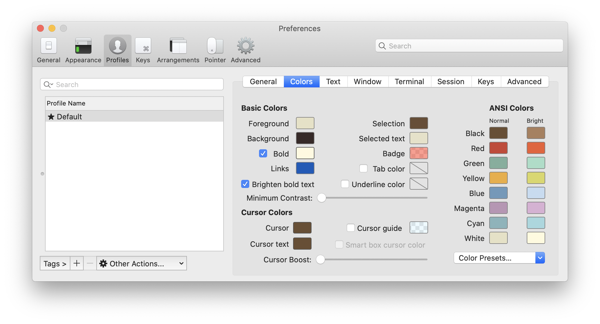
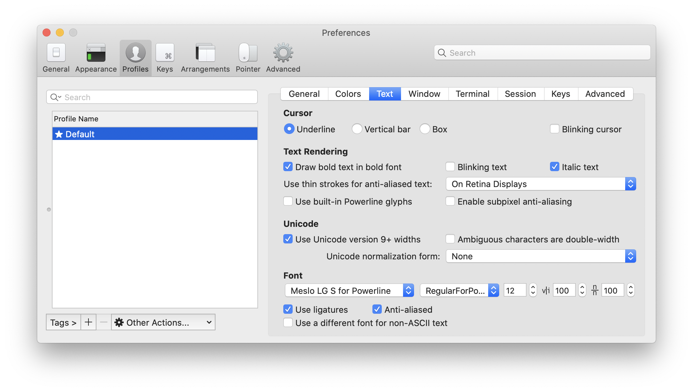

# Настраиваем консоль

1. Запускаем терминал.
2. Скачиваем менеджер пакетов `homebrew`: https://brew.sh – заходим и копируем команду `/bin/bash -c "$(curl -fsSL https://raw.githubusercontent.com/Homebrew/install/master/install.sh)"`.
3. Проверяем что все установилось, выполнив команду `brew -v` в терминале. Если все ок, то увидим версию `homebrew`.
4. Устанавливаем `iTerm 2`: `brew cask install iterm2`.
5. Выбираем в настройках `iTerm 2` понравившуюся нам цветовую схему, я использую `Birds of Paradise`. Найти можно тут: https://github.com/mbadolato/iTerm2-Color-Schemes

6. Устанавливаем шрифты: подключаем новый репозиторий с шрифтами в `homebrew`: `brew tap homebrew/cask-fonts` и устанавливаем шрифт Meslo (он классный потому что лигатуры) `brew cask install font-meslo-for-powerline`. Не забываем в настройках `iTerm 2` выбрать установленный шрифт.

7. Устанавливаем `Sublime`, потому что это офигенный быстрый текстовый редактор `brew cask install sublime-text`.
7. Устанавливаем `zsh`, на последних версиях макоси это делать не обязательно. Чтоб проверить можно выполнить команду `echo $SHELL`, если там будет какой-нибудь `/bin/zsh`, то можно пропускать, иначе `brew install zsh`.
8. Устанавливаем менеджер дополнений `oh-my-zsh` для `zsh`: идем на https://github.com/ohmyzsh/ohmyzsh и выполняем `sh -c "$(curl -fsSL https://raw.githubusercontent.com/ohmyzsh/ohmyzsh/master/tools/install.sh)"`.
9. Устанавливаем тему `spaceship`: `git clone https://github.com/denysdovhan/spaceship-prompt.git "$ZSH_CUSTOM/themes/spaceship-prompt"` и `ln -s "$ZSH_CUSTOM/themes/spaceship-prompt/spaceship.zsh-theme" "$ZSH_CUSTOM/themes/spaceship.zsh-theme"`.
10. Редактируем `zsh` - выбираем тему `spaceship`: `subl ~/.zshrc`, там находим переменну `ZSH_THEME` и меняем ее значение на `spaceship`.
11. Перезапускаем `iTerm 2` и наслаждаемся прекрасным